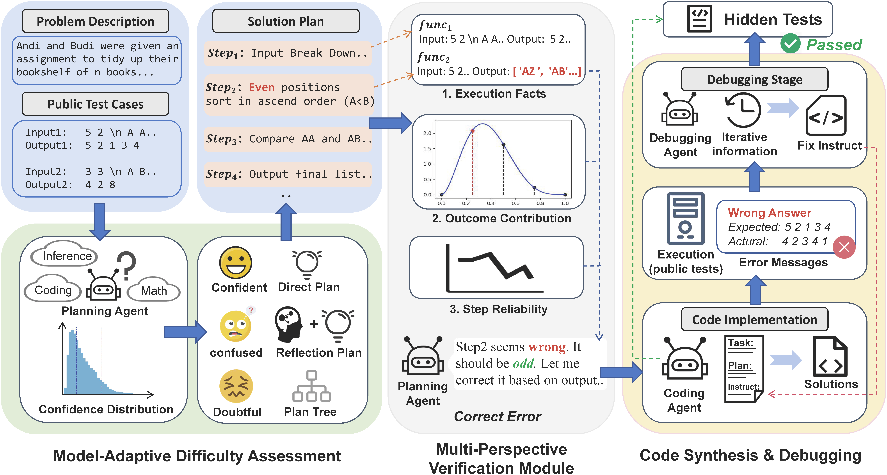

# MavenCoder


## 📢 News

🎉 **Accepted to ACL 2026 (Main Conference)**


## 📖Overview

With the rapid advancement of large language models (LLMs), automated code generation has made remarkable progress. Recent studies explore multi-agent collaboration and adopt plan–code–debug workflows to enhance performance. However, these approaches are constrained by rigid, predefined workflows that fail to flexibly adjust their reasoning steps and lack effective verification of intermediate solution steps. In this work, we propose **MavenCoder, a model-adaptive verification–enhanced framework for competition-level code generation.** 

MavenCoder leverages adaptive assessment aligned with the model’s capabilities to select problem-solving strategies, while providing timely feedback and correction via multi-dimensional verification. This teaching-to-the-problem paradigm substantially mitigates earlier limitations by enabling flexible planning, deeper exploration, and accurate self-correction. Compared with existing state-of-the-art approaches, MavenCoder achieves superior pass@1 results across multiple benchmarks, achieving 87.5% on LiveCodeBench, 93.9% on HumanEval+, 81.7% on MBPP+, and 46.1% on CodeContests, outperforming recent agent-based systems like LPW and CodeTree with improvement exceeding 3%--40%.




## 🧪Prepare Environment

MavenCoder is developed and tested on Ubuntu 18.04.6 LTS and Python 3.11.
Please follow these steps to set up the Python environment:

```bash
conda create -n mavencoder python=3.11 -y
conda activate mavencoder
pip install -r requirements.txt
```

### Configuration

Before running the code, configure your API credentials in `run.sh`:

```bash
key="your-api-key-here"
url="your-api-url-here"  # Optional: defaults to OpenAI official endpoint if not set

# Embedding API configuration (optional, only needed if different from main API)
embedding_key="your-embedding-api-key-here"  # Optional: defaults to main key if not set
embedding_url="your-embedding-api-url-here"  # Optional: defaults to main url if not set
```

**Note:**
- If `url` is not specified, the system defaults to the official OpenAI API endpoint.
- **For Qwen3-coder-plus model:** You need to configure both `url` and `key` according to the [Alibaba Cloud Bailian documentation](https://modelstudio.console.aliyun.com/?tab=api#/api).
- **Important - Embedding Model Configuration:** The system uses OpenAI's `text-embedding-3-large` model for embeddings. If your main API endpoint does not provide this model (e.g., when using Qwen or other non-OpenAI models), you **must** configure `embedding_key` and `embedding_url` to point to an endpoint that supports `text-embedding-3-large` (typically OpenAI's official API). If not specified, the embedding will attempt to use the same `key` and `url` as the main model, which will fail if that endpoint doesn't support the embedding model.


## 🚀Quick Start

```bash
bash run.sh
```

Results are saved as a JSON Lines (`.jsonl`) file at the specified `./output` path. 

## ⚙️Parameters

| Parameter | Description | Default | Choices |
|-----------|-------------|---------|---------|
| `--model` | Model name | Required | gpt-4o-mini, gpt-4.1-nano, qwen3-coder-plus |
| `--dataset_type` | Dataset type | Required | lcb, code_contests, humanevalplus, mbppplus |
| `--key` | API key | Required | - |
| `--url` | API endpoint URL | OpenAI official endpoint | - |
| `--embedding_key` | Embedding API key (if different from main API) | Same as `--key` | - |
| `--embedding_url` | Embedding API endpoint URL (if different from main API) | OpenAI official endpoint | - |
| `--output_path` | Output file path (JSONL)(If not null the program will not create new one) | `./output/` | - |
| `--strategy` | Difficulty assessment strategy | mean_prob | mean_prob, entropy, prompt |
| `--theta_1` | Confidence threshold (Low) | 0.15 | - |
| `--theta_2` | Confidence threshold (High) | 0.45 | - |
| `--r_global` | Max global iterations | 3 | - |
| `--r_debug` | Max debug iterations | 3 | - |
| `--r_valid` | Max verification iterations | 1 | - |
| `--verbose` | Display detailed logs | False | True, False |
| `--max_workers` | Max concurrent workers | 6 | - |
| `--log_dir` | Log directory path | `./log/` | - |

## 📊Evaluation

After completing a dataset run, all post-processed results will be saved in the `./test/` folder.

### Evaluation Methods by Dataset

- **HumanEval+ and MBPP+**: Use the [EvalPlus](https://github.com/evalplus/evalplus) evaluation framework for comprehensive testing.
- **LiveCodeBench (LCB) and CodeContests**: Refer to the [LiveCodeBench](https://github.com/LiveCodeBench/LiveCodeBench) evaluation guidelines.
